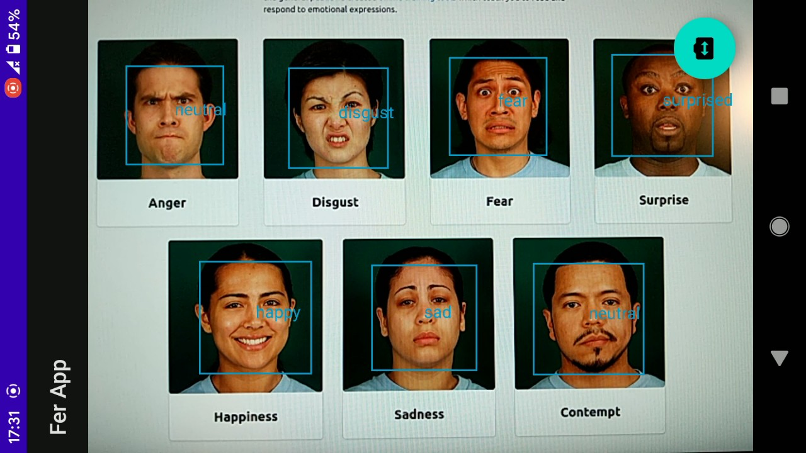

# Android app for real-time emotion recognition

The app lets you recognize people's emotions using your smartphone's camera.

### App

At first, it identifies faces visible through smartphone's camera. Then, based on a facial expression, it predicts 1 of 7 basic emotions (angry, disgust, fear, happy, sad, surprise, contempt) or neutrality.

You can also see it in action on the video.

#### Strengths and weaknesses

It is the most accurate when a person faces the camera directly and the facial expression is obvious as if it was made by an actor. It is because the model was trained on face images like on the screenshot above. If you want to play with it, you will have the best results when making faces like these.

The model has a tendency to predict neutral or happy most of the time. It reasonably identifies surprised, angry or sad and doesn't perform very well when it comes to disgust, fear and contempt. It is because the training dataset had over-representation of happy and neutral faces, while contempt or disugst had just a few examples.

Another thing is that prediction is based on a single camera frame. It would possibly be more effective if the model considered a sequence of frames. This way, it could consider a small facial movement instead of just a snapshot of a face.

### How to use

You can download the beta version of the app directly from [Google Play](https://play.google.com/store/apps/details?id=com.vicksam.ferapp).\
*(at the moment of writing it is under review from the store and will be available through the link as soon as it is accepted)*

The repo contains complete code of the app. If you want to play with it, just import the project to the Android Studio.

The model file is located under `app/src/main/assets`. To know more about it, you can go to the [model's repo](https://github.com/vicksam/fer-model).

### Libraries

* [CameraView](https://github.com/natario1/CameraView)
* ML Kit
* Tensorflow Lite

### Project overview

I built it to showcase my [emotion identification model](https://github.com/vicksam/fer-model) and to present how it works in practice. The model was converted to *.tflite* file before and here I deploy it on Android.

To start with, I used [face detection library](https://github.com/husaynhakeem/android-face-detector) by Husayn Hakeem. It provides you with a working implementation based on CameraView with ML Kit face detector. And enables you to detect faces live using your smartphone's camera.

However, I modified it to quite an extent. At first, I needed a way to work further with detected faces. So I wrote an appropriate code that cuts face images out of a camera frame and provides them through a listener. Secondly, I noticed that the original implementation had some problems with rendering boxes around faces when a smartphone was rotated. So I basically rewrote the part that is responsible for calculating their coordinates. It was quite a bit of work.

And of course, I deployed the model using Tensorflow Lite. I wrote the code that enables running the model on Android, as well as the parts with necessary data processing before and after the prediction.

My main goal was to showcase the model, so I tried to keep the code simple. I could have used RxJava for example, but decided that it would be an overkill for such a basic app.
